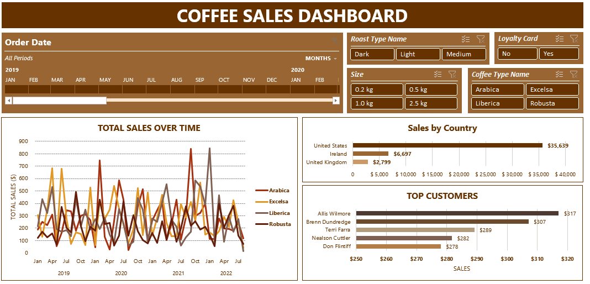

# ☕ Coffee Sales Dashboard (Excel)

This project is an interactive **Excel dashboard** built to analyze and visualize coffee sales data. Starting from raw data across three sheets — Orders, Customers, and Products — the dataset was cleaned, enriched, and transformed using Excel formulas and functions. Final visualizations were created using PivotTables, charts, slicers, and timelines.

---

## 📊 Features

- **Data Cleaning & Transformation**
  - Used `XLOOKUP` to pull customer details (name, email, country) into the Orders sheet.
  - Used `INDEX-MATCH` to retrieve product details (coffee type, roast type, size, unit price).
  - Added calculated columns (e.g., Sales = Quantity × Unit Price).
  - Applied conditional formulas to create clean labels for coffee type and roast.

- **Dashboard Visuals**
  - **Line chart** showing total sales over time with a timeline filter.
  - **Bar chart** for sales by country.
  - **Bar chart** of top customers by sales.
  - **Slicers** for Coffee Type, Roast Type, Size, and Loyalty Card status.
  - Fully interactive layout compiled into a single dashboard sheet.

---

## 📁 Source Data

- `Orders` – Contains order ID, date, product/customer reference, and quantity.
- `Customers` – Contains customer ID, name, contact info, and country.
- `Products` – Contains product ID, coffee attributes, and pricing details.

---

## 🧭 How to Use

1. Download and open the Excel file.
2. Go to the **Dashboard** sheet.
3. Use the **timeline** to filter by date range.
4. Use the **slicers** to explore specific coffee types, sizes, roast levels, or loyalty card usage.
5. Watch the charts update automatically based on your selections.

---

## 📷 Dashboard Preview

---

## 📎 Tools Used

- Microsoft Excel (Functions: `XLOOKUP`, `INDEX`, `MATCH`, `IF`, calculated columns)
- PivotTables and PivotCharts
- Slicers and Timelines for interactivity

---

## 📝 License

This project is open source under the MIT License.
